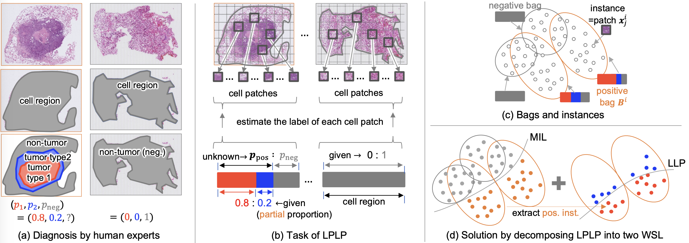

# Learning from Partial Label Proportions for Whole Slide Image Segmentation [[S.Matsuo+, MICCAI2024](https://arxiv.org/abs/2405.09041)]

Shinnosuke Matsuo, Daiki Suehiro, Seiichi Uchida, Hiroaki Ito, Kazuhiro Terada, Akihiko Yoshizawa, Ryoma Bise



>In this paper, we address the segmentation of tumor subtypes in whole slide images (WSI) by utilizing incomplete label proportions. Specifically, we utilize `partial' label proportions, which give the proportions among tumor subtypes but do not give the proportion between tumor and non-tumor. Partial label proportions are recorded as the standard diagnostic information by pathologists, and we, therefore, want to use them for realizing the segmentation model that can classify each WSI patch into one of the tumor subtypes or non-tumor. We call this problem ``learning from partial label proportions (LPLP)'' and formulate the problem as a weakly supervised learning problem. Then, we propose an efficient algorithm for this challenging problem by decomposing it into two weakly supervised learning subproblems: multiple instance learning (MIL) and learning from label proportions (LLP). These subproblems are optimized efficiently in an end-to-end manner. The effectiveness of our algorithm is demonstrated through experiments conducted on two WSI datasets.

## Requirements
* python >= 3.9
* cuda && cudnn

We strongly recommend using a virtual environment like Anaconda or Docker. The following is how to build the virtual environment for this code using anaconda.
```
# pytorch install (https://pytorch.org/get-started/locally/)
$ pip3 install torch torchvision torchaudio --index-url https://download.pytorch.org/whl/cu118
$ pip install -r requirements.txt
```

## Dataset
You can create dataset by running following code. Dataset will be saved in `./dataset` directory.
```
$ python src/make_dataset.py --dataset='cifar10' --num_classes=10 --num_instances=32
```

## Training & Test
```
$ python src/main.py --dataset='cifar10' --num_classes=10 --num_instances=32 --output_path='result/'
```

## Arguments
You can set up any parameters at `config.py`

## Citation
If you find this repository helpful, please consider citing:
```
@inproceedings{matsuo2024lplp,
  title = {Learning from Partial Label Proportions for Whole Slide Image Segmentation},
  author = {Shinnosuke Matsuo and Daiki Suehiro and Seiichi Uchida and Hiroaki Ito and Kazuhiro Terada and Akihiko Yoshizawa and Ryoma Bise},
  booktitle={International Conference on Medical Image Computing and Computer-Assisted Intervention},
  year = {202４},
}
```